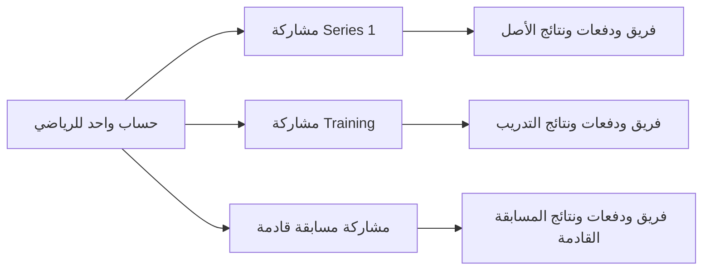

# Training ومشاركة الرياضي في أكثر من مسابقة

حالة التنفيذ: الكود وأدوات التشغيل مختبرة محليًا. أصبح اتصال SSH متاحًا وتم التحقق من سلامة الخدمة؛ النشر ونسخ بيانات التدريب يتبعان الخطوات أدناه بعد نجاح بوابة الإصدار والنسخة الاحتياطية. إجراءات النشر العامة في `docs/OPERATIONS.md`؛ معلومات الاتصال تبقى في الملف المحلي السري فقط.

## السلوك المنفذ

- نفس الموقع وقاعدة البيانات وحساب `User` الواحد؛ لا نسخ حسابات أو كلمات مرور ولا خدمة مزامنة.
- `SeriesParticipant` يربط الرياضي بكل مسابقة بصورة مستقلة. المستوى والفئة والمقاس والشريك وطلبات الشراكة تخص المسابقة.
- `Team` و`Competitor` جديدان للتدريب، مع نفس `userId`. الدفعات والنتائج والـWaves والمحطات مستقلة.
- تعديل الاسم والهاتف من «Personal details» يعدل الحساب المشترك وتقرأه واجهات الفرق في المسابقتين. نموذج الفريق لا يستطيع تغيير هوية حساب شريكه.
- اختيار `/me` الافتراضي: مسابقات الرياضي الجارية أولًا (الحدث الحقيقي قبل التدريب عند تعدد الأحداث الجارية)، ثم القادمة حسب تاريخها. لا اختيار تلقائي لمسابقة لا يشارك فيها المستخدم.
- المنتهية تظهر في «Already completed» خارج قائمة الاختيار. المسابقات المجدولة التي مضى تاريخها لا تظهر كقادمة. المقارنة تستخدم يوم الحدث بتوقيت قطر.
- الانضمام لمسابقة قادمة يستخدم الحساب الموجود ويضيف مشاركة جديدة فقط؛ التسجيلات الجديدة لا تنسخ تلقائيًا إلى التدريب.
- تعديل الفريق والشريك ورفع الصورة يحمل معرّف المسابقة، مع التحقق من ملكية التسجيل. أُلغي منح الوصول إلى فريق بتشابه الاسم.
- إنشاء الفريق وربط الرياضيين في معاملة واحدة، مع قفل صف المسابقة قبل منع التسجيل المكرر. يسمح للشخص نفسه بالمشاركة في مسابقات مختلفة.

## الترحيل

`prisma/migrations/20260924120000_series_participants/migration.sql` يضيف المشاركات وسياق طلبات الشراكة وعلامة التدريب. يبني المشاركات من المقاعد المثبتة ثم اختيار التسجيل القديم. لا يعيد كتابة صفوف الحسابات أو الفرق أو المقاعد أو المدفوعات أو الدرجات.

تبقى حقول `AthleteProfile` و`requestedSeriesId` القديمة للتوافق والتفضيلات الأولية، ولا تحدد شريك الرياضي في مسابقة أخرى. الطلبات القديمة التي لا يمكن إثبات مسابقتها تبقى محفوظة خارج الإجراءات الجديدة. الأداة ترفض نسخ مصدر فيه تسجيلات مكررة أو مقاعد مرتبطة بحساب دون مشاركة مقابلة؛ لا تصلح المصدر تلقائيًا.

الموافقة العامة على الحساب باقية؛ لم تُضف دورة موافقات منفصلة لكل حدث. لا تعتبر الدفعة المنسوخة إلى التدريب إثبات دفع جديدًا يسمح بترقية موافقة الحساب.

## نسخ المشاركات مرة واحدة

`node scripts/copy-training.mjs --source podium-bft-series-1 --target <training-slug>`

الأمر دون `--apply` تقرير معاينة فقط. يعرض معرفي المصدر والهدف، أعداد الحذف والنسخ وبصمتي البيانات، دون بيانات دخول. يجب تأكيد أن الهدف هو مسابقة التدريب المقصودة من التقرير.

التنفيذ بعد نجاح الاختبارات والبوابة والنشر والترحيل والنسخة الاحتياطية:

`node scripts/copy-training.mjs --source podium-bft-series-1 --target <training-slug> --apply --confirm-target-id <training-id> --mark-training`

الحماية المطبقة:

1. يرفض تطابق المصدر والهدف، ويرفض دائمًا `podium-bft-series-1` كهدف للمسح، ويرفض معرف تأكيد غير مطابق.
2. يقفل بيانات الهدف ويحفظ تقريرًا ونسخة استرجاع خاصة بالتدريب داخل `db-backups/` قبل أول حذف. ملفات النسخ محلية ومستبعدة من Git وتحتوي بيانات حساسة.
3. يزيل فرق ومقاعد التدريب القديمة وتوابع درجاتها وصورها، والـWaves وطلبات الشراكة والمشاركات وCRM intake الخاصة بالهدف. لا يزيل الحسابات أو إعدادات المسابقة أو الحكام أو الاستوديوهات المشتركة.
4. ينسخ الفرق النشطة والمشاركات النشطة، بما فيها الرياضيون الذين لم يدخلوا فريقًا. يحتفظ بحالة الدفع والمبلغ كتجربة، دون أي تحصيل أو فاتورة أو رسالة. مصدر الفريق `seed` ومعرفه الخارجي للتدريب، لمنع اعتباره إعادة إدخال من CRM.
5. يبدأ بلا درجات أو حضور أو محطات أو موجات أو صور مولدة. لا يغير موعد Training أو إعدادات تسجيل النتائج؛ تضبط تلك الإعدادات داخل التدريب لتناسب يوم التجربة.
6. يراجع أعداد الهدف وبصمة المصدر في نفس المعاملة؛ أي فشل يعيد العملية كاملة. التكرار بعد النجاح مرفوض حتى لا يمسح تجارب المستخدمين اللاحقة.
7. يسجل المصدر ووقت النسخ على Training ويوقف ظهوره في التسجيل العام. لا يرسل دعوات ولا إشعارات جماعية.

نسخة `.rollback.sql` الناتجة تستعيد التدريب وحده، مع إزاحة تجاربه اللاحقة؛ راجع معرف الهدف قبل تشغيلها. لا تستخدم استعادة قاعدة الإنتاج كاملة للتراجع عن التدريب.

## تنظيف حسابات الاختبار

`node scripts/cleanup-training-users.mjs --target <training-slug>`

للتطبيق بعد مراجعة التقرير:

`node scripts/cleanup-training-users.mjs --target <training-slug> --apply --confirm-domain bftmena.com`

ينطبق فقط على الدومين المطابق `@bftmena.com`. يستخدم آلية الحذف القابلة للاسترجاع في التطبيق: أرشفة الحساب وتعطيله، مع إبقاء السجل التاريخي. يحفظ بيانات ما قبل الأرشفة محليًا. لا يحذف الحسابات نهائيًا.

يحمي حسابات الإدارة والموظفين، وأي حساب مرتبط بمسابقة أخرى، بما فيها التسجيلات المرتبطة بالبريد دون `userId`، والشراكات والتكليفات والسجلات الأخرى. بعض الحسابات قد تبقى محمية رغم الدومين؛ يعرض التقرير أسباب ذلك ولا يغيرها تلقائيًا. لا يلغي عضوية الرياضي الحقيقي ولا يغيّر حسابه لمجرد مشاركته في التدريب.

## التحقق قبل الإنتاج

نتيجة التحقق المحلي بتاريخ 24 سبتمبر 2026: نجح `npm test` بالكامل (844 اختبارًا)، و`type-check` و`lint` وبناء الإنتاج. نجح أيضًا اختبار MySQL على schema مؤقتة واختبار Chromium على شاشة موبايل، بما فيه حفظ اختيار Training أثناء التنقل، التسجيل بالحساب نفسه، وتعديل الهوية المشتركة. لم تُنفذ بوابة GitHub أو اختبارات ما بعد النشر بعد؛ لم يحدث رفع إلى `origin/main`.

- `npm run type-check`
- `npm run lint`
- `npm test`
- `npm run build`
- `node scripts/training-integration.mjs --baseline-sql <pre-change-schema.sql>`
- بعد البناء: الأمر نفسه مع `--ui` لاختبار المتصفح.

اختبار التكامل يرفض أي اتصال غير محلي. ينشئ schema محلية مؤقتة باسم عشوائي ويحذفها عند الانتهاء؛ هذه fixture للاختبار وليست معمارية التطبيق. مدخل baseline هو SQL schema ما قبل التغيير، يولد عبر `prisma migrate diff --from-empty --to-schema <pre-change-schema.prisma> --script`.

يتحقق من الترحيل دون تغيير الحسابات والفرق والنتائج القديمة، المعاينة بلا كتابة، حماية الأصل، فشل متعمد أثناء الإدخال والتراجع الكامل، هوية الحساب المشتركة، استقلال التشغيل، منع إعادة النسخ، حماية الحسابات الحقيقية أثناء تنظيف الدومين، واستعادة Training وحده. خيار المتصفح يختبر الافتراضي والتبديل على الموبايل، إخفاء المنتهية من القائمة، رفض مسابقة الغير، الاشتراك بحساب قائم، وظهور تعديل الاسم في المسابقتين.

قبل أي إنتاج: commit على `origin/main` ناجح في `podium/gates` ونسخة حديثة مثبتة في `/opt/backups`. ثم إجراء النشر المعتمد، وترحيل Prisma مباشرة وإعادة تشغيل الخدمة وفحص `/api/health`. لا استخدام لـ`--force` ولا تجاوز للبوابة.

## حدود النطاق

تشغيل المسابقات مستقل داخل البيانات والواجهات. لا يوجد عامل مزامنة للتسجيلات أو الفرق أو الدفعات. اكتشاف تعارض مواعيد موجات الرياضي بين مسابقتين حقيقيتين مستقبلًا يحتاج قاعدة جدولة إضافية؛ لا نمنع الاشتراك في أكثر من مسابقة بتقييد عام على الحساب. بيانات الدور والحساب مشتركة عمدًا؛ تعديل حساب عالمي يظل تعديلًا عامًا واضحًا في واجهته.
