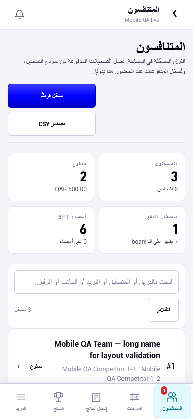
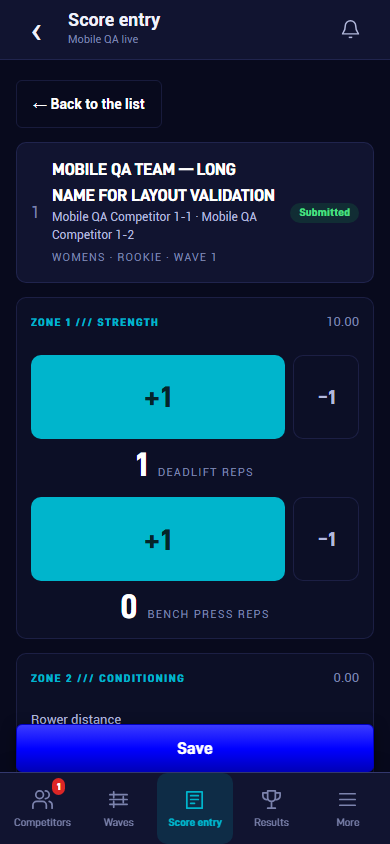

# Mobile visual review

Actual browser screenshots from the local PODIUM review build. Phones are 390×844px; the tablet screenshot is a 1024px **Capacitor platform simulation**, not a native iPad capture. Operational examples use dedicated `mobile-e2e` fixture records. The root fallback is explicitly labelled as an isolated component preview.

See [screen coverage and test outcomes](../MOBILE-SCREEN-COVERAGE.md) and [test-build/device instructions](../MOBILE-UX.md).

| Example | Screenshot |
| --- | --- |
| Competition registrations, English / dark | [en-registration-list.png](en-registration-list.png) |
| Competition registrations, Arabic / light | [ar-registration-list.png](ar-registration-list.png) |
| Score entry with a primary action above tabs | [en-score-entry.png](en-score-entry.png) |
| Full registration editor, Arabic / light | [ar-registration-edit.png](ar-registration-edit.png) |
| Competitor My team, Arabic / light | [ar-my-team.png](ar-my-team.png) |
| Full zone editor, Arabic / light | [ar-zone-editor.png](ar-zone-editor.png) |
| Full permission editor with bottom Save | [ar-role-editor.png](ar-role-editor.png) |
| Public results choices with readable contrast | [ar-public-results.png](ar-public-results.png) |
| More as a full-screen menu | [en-more.png](en-more.png) |
| Short filters as a bottom sheet | [en-filters.png](en-filters.png) |
| Capacitor tablet layout simulation with two card columns | [tablet-layout.png](tablet-layout.png) |
| Administrator live board with app navigation | [en-live-board.png](en-live-board.png) |
| Studio live board with scoped navigation, Arabic | [ar-live-board.png](ar-live-board.png) |
| Administrator account with the four platform tabs, Arabic | [ar-account.png](ar-account.png) |
| Administrator inbox with More selected, Arabic | [ar-notifications.png](ar-notifications.png) |
| Administrator account, English / dark | [en-account.png](en-account.png) |
| Administrator inbox, English / dark | [en-notifications.png](en-notifications.png) |
| Root error fallback, Arabic (isolated component preview) | [ar-global-error.png](ar-global-error.png) |
| Root error fallback, English (isolated component preview) | [en-global-error.png](en-global-error.png) |

Full-page and viewport captures for all page templates remain in `.mobile-qa/screenshots/`. Local directories can include existing seed records and are not copied wholesale into this gallery. Physical iPhone/iPad/Android captures and binary build validation are pending.
